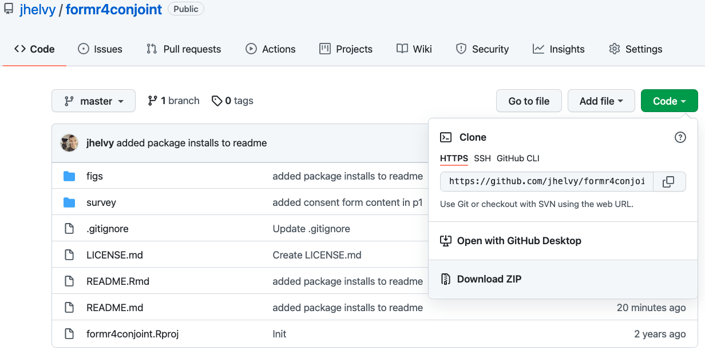
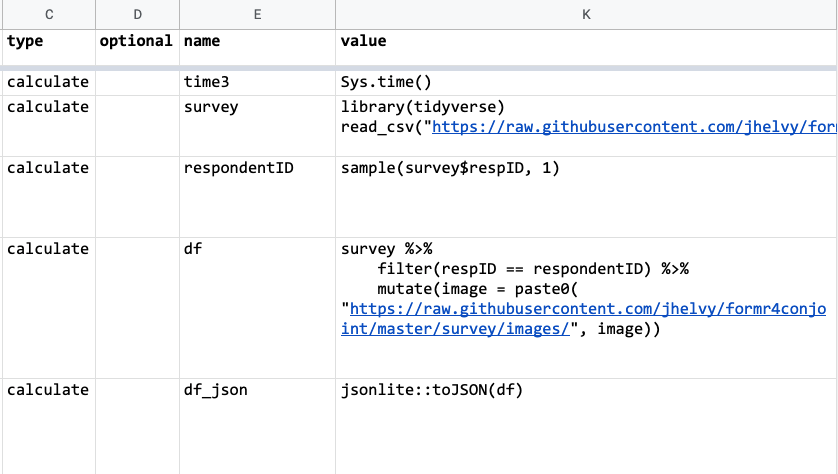
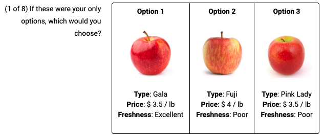

```{r setup, child="../setup.Rmd"}
```

```{r}
#| include: false

# For this class

# make surveys
library(cbcTools)

# Define profiles with attributes and levels
profiles <- cbc_profiles(
    price       = c(15, 20, 25), # Price ($1,000)
    fuelEconomy = c(20, 25, 30), # Fuel economy (mpg)
    accelTime   = c(6, 7, 8),    # 0-60 mph acceleration time (s)
    powertrain  = c("Gasoline", "Electric")
)
# Make a full-factorial design of experiment
design <- cbc_design(
    profiles = profiles,
    n_resp   = 500, # Number of respondents
    n_alts   = 3,   # Number of alternatives per question
    n_q      = 8    # Number of questions per respondent
)
# Make a labeled full-factorial design of experiment
design_labeled <- cbc_design(
    profiles = profiles,
    n_resp   = 500, # Number of respondents
    n_alts   = 2,   # Number of alternatives per question
    n_q      = 8,   # Number of questions per respondent
    label    = "powertrain"
)
# Make a survey with no choice option
design_nochoice <- cbc_design(
    profiles = profiles,
    n_resp   = 500, # Number of respondents
    n_alts   = 3,   # Number of alternatives per question
    n_q      = 8,   # Number of questions per respondent
    no_choice = TRUE
)

design_short <- design %>%
  mutate(
    price = scales::dollar(price),
    fuelEconomy = paste0(fuelEconomy, " (mpg)"),
    accelTime = paste0(accelTime, " (s)")
  ) %>% 
  select(
    respID, qID,
    `Option:` = altID, 
    `Price:` = price, 
    `Fuel Economy:` = fuelEconomy, 
    `Accel. Time:` = accelTime, 
    `Powertrain:` = powertrain
  )
design_labeled_short <- design_labeled %>%
  mutate(
    price = scales::dollar(price),
    fuelEconomy = paste0(fuelEconomy, " (mpg)"),
    accelTime = paste0(accelTime, " (s)")
  ) %>% 
  select(
    respID, qID,
    `Option:` = powertrain, 
    `Price:` = price, 
    `Fuel Economy:` = fuelEconomy, 
    `Accel. Time:` = accelTime
  )
design_nochoice_short <- design_nochoice %>%
  mutate(
    price = scales::dollar(price),
    fuelEconomy = paste0(fuelEconomy, " (mpg)"),
    accelTime = paste0(accelTime, " (s)"),
    price = ifelse(altID == 4, "", price),
    fuelEconomy = ifelse(altID == 4, "", fuelEconomy),
    accelTime = ifelse(altID == 4, "", accelTime),
    powertrain = ifelse(powertrain_Electric == 1, "Electric", "Gasoline"),
    powertrain = ifelse(altID == 4, "", powertrain),
    altID = ifelse(altID == 4, "None", altID)
  ) %>% 
  select(
    respID, qID,
    `Option:` = altID, 
    `Price:` = price, 
    `Fuel Economy:` = fuelEconomy, 
    `Accel. Time:` = accelTime, 
    `Powertrain:` = powertrain
  )
row.names(design_nochoice_short) <- seq(nrow(design_nochoice_short))
design_q1 <- design_short %>%
  filter(respID == 1, qID == 1) %>% 
  select(-respID, -qID)
design_q2 <- design_short %>%
  filter(respID == 1, qID == 2) %>% 
  select(-respID, -qID)
design_labeled_q1 <- design_labeled_short %>%
  filter(respID == 1, qID == 1) %>% 
  select(-respID, -qID)
design_labeled_q2 <- design_labeled_short %>%
  filter(respID == 1, qID == 2) %>% 
  select(-respID, -qID)
design_nochoice_q1 <- design_nochoice_short %>%
  filter(respID == 1, qID == 1) %>% 
  select(-respID, -qID)
design_nochoice_q2 <- design_nochoice_short %>%
  filter(respID == 1, qID == 2) %>% 
  select(-respID, -qID)
```

---

class: inverse, middle, center

# Some Quarto tips

---

### .center[Convert a data frame to a markdown table with `kable()`]

--

```{r, eval=FALSE}
library(tidyverse)

mtcars %>% 
  kable()
```

--

.font80[

```{r, echo=FALSE}
mtcars %>% 
  kable()
```

]

---

### .center[Example from last year]

```{r, eval=FALSE}
library(tidyverse)
library(here)

df <- read_csv(here("data", "competitors.csv"))
df %>% 
  kable()
```

.font80[

```{r, echo=FALSE}
library(tidyverse)
library(here)

df <- read_csv(here("data", "competitors.csv"))
df %>% 
  kable()
```

]

---

class: center, middle 

# More `kable()` formatting options:<br>[{kableExtra} package](https://cran.r-project.org/web/packages/kableExtra/vignettes/awesome_table_in_html.html)

---

# References

**Simple approach**: Insert a footnote with `^[]` 

### markdown

`The Eiffel Tower is 324 meters tall^[From the [Eiffel Tower wikipedia page](https://en.wikipedia.org/wiki/Eiffel_Tower)]`

### render

The Eiffel Tower is 324 meters tall<sup>1</sup>

.font70[<sup>1</sup>From the [Eiffel Tower wikipedia page](https://en.wikipedia.org/wiki/Eiffel_Tower)]

---

# References

**Complex (but more complete) approach**: Use bibtex 

https://quarto.org/docs/authoring/footnotes-and-citations.html

You can insert citations with `[@citekey]`, and a "References" table will be automatically created.

--

<br>

**Footnotes are perfectly fine for this class**

---

```{r child="topics/0.Rmd"}
```

---

```{r child="topics/1.Rmd"}
```

---

class: center 

## Download the [logitr-cars](https://github.com/jhelvy/logitr-cars) repo from GitHub

<center>

</center>

---

## .center[We'll be using the [{cbcTools} package](https://jhelvy.github.io/cbcTools/) today]

```{r, eval=FALSE}
install.packages("cbcTools")
```

---

# Choice question components

### 1. Generate `profiles` for each attribute and level

### 2. Create a survey `design` data frame from `profiles`

---

class: center 

# Basic Design

Any combination of attributes can be shown in each choice question

.leftcol[.font90[

## Question 1

```{r, echo=FALSE}
kable(t(design_q1))
```

]]

.rightcol[.font90[

## Question 2

```{r, echo=FALSE}
kable(t(design_q2))
```

]]

---

class: center 

# Labeled Design

One attribute is used as the "label" - choice options are fixed according to the label

.leftcol[.font90[

## Question 1

```{r, echo=FALSE}
kable(t(design_labeled_q1))
```

]]

.rightcol[.font90[

## Question 2

```{r, echo=FALSE}
kable(t(design_labeled_q2))
```

]]

---

class: center

# Design with a "None" option

A "none" option means they can choose an "other" option

.leftcol[.font90[

## Question 1

```{r, echo=FALSE}
kable(t(design_nochoice_q1))
```

]]

.rightcol[.font90[

## Question 2

```{r, echo=FALSE}
kable(t(design_nochoice_q2))
```

]]

---

class: middle, inverse, center

# Open `logitr-cars.Rproj`

---

# Attribute-specific features

Some attributes may only be valid for certain levels of other attributes

> **Example**: The driving range of an electric vehicle (EV) only applies to EVs and not gasoline-powered vehicles.

--

<br>

To implement this, edit `profiles` prior to using `cbc_design()`

---

# Restricted profiles

Sometimes you may want to not allow a specific combination of features  -  use `cbc_restrict()` to implement this 

(see `logitr-cars` code 1.3)

--

<br> 

# .red[Warning]: Avoid restrictions if possible!

---

class: inverse

```{r, echo=FALSE}
countdown(
  minutes = 20,
  warn_when = 15,
  update_every = 1,
  top = 0,
  right = 0,
  font_size = '2em'
)
```

## Your Turn

1. With your team, discuss the specific choice question design for your project

- Regular or labeled?
- Include a "none" option (outside good) or not?
- Include restrictions?

2. Edit the `make-choice-questions.R` file to design your choice questions.

---

```{r child="topics/2.Rmd"}
```

---

# .center[Displaying your choice questions online]

### 1. Export your choice questions as a .csv file
### 2. Upload your .csv file somewhere (e.g. GitHub)
### 3. Use R code to extract the values to display 
### 4. Use RMarkdown to display the values

---

### 1. Export your choice questions as a .csv file

```{r, eval=FALSE}
write_csv(design, here('choice_questions.csv'))
```

--

### 2. Upload your .csv file somewhere

.leftcol[.center[

### Inside a formr run (private)

<center>

</center>

]]

.rightcol[.center[

### github.com (public)

.font200[[`r fa("github")`](https://github.com/)]

[apples example](https://github.com/jhelvy/formr4conjoint)

]]

---

## .center[Use R code to extract the values to display]

### - Read `choice_questions.csv` from web
### - Randomly choose a respondent ID
### - Filter rows for that respondent ID
### - Serialize the data frame to json format

---

# .center[Side note on serializing a data frame]

.center[Converts a data frame to one long string]

```{r, echo=FALSE}
df <- design %>%
  filter(obsID == 1) %>% 
  select(-respID, -qID, -obsID)
```

```{r}
df
```

```{r}
df_json <- jsonlite::serializeJSON(df)
df_json
```

---

# .center[Use RMarkdown to display the values]

.leftcol[

Create separate data frames for each alternative

```{r}
library(dplyr)

alts <- jsonlite::unserializeJSON(df_json)
alt1 <- alts %>% filter(altID == 1)
alt2 <- alts %>% filter(altID == 2)
alt3 <- alts %>% filter(altID == 3)
```

]

--

.rightcol[

Use RMarkdown formatting to display content in each alternative

```{r, eval=FALSE}
***Option 1**

***Price**: $ `r alt1$price`
***Powertrain**: $ `r alt1$powertrain`
***Fuel Economy**: `r alt1$fuelEconomy` mpg
***0-60 Accel. Time**: `r alt1$accelTime` s
```

**Option 1**

**Price**: $ `r alt1$price`<br>
**Powertrain**: $ `r alt1$powertrain`<br>
**Fuel Economy**: `r alt1$fuelEconomy` mpg<br>
**0-60 Accel. Time**: `r alt1$accelTime` s

]

---

## .center[Show options in a table with `kable()`]

.leftcol[

```{r}
library(dplyr)

alts <- jsonlite::unserializeJSON(df_json) %>%
  # Add $ sign to price
  mutate(price = scales::dollar(price)) %>% 
  # Make nicer attribute labels
  select(
    `Option:`             = altID, 
    `Powertrain:`         = powertrain,
    `Price:`              = price, 
    `Fuel Economy (mpg):` = fuelEconomy, 
    `Accel. Time (s):`    = accelTime)

# Drop row names
row.names(alts) <- NULL
```

]

.rightcol[

Display the _transpose_, `t(alts)`

```{r}
kable(t(alts))
```

]

---

class: center 

## Download the [formr4conjoint](https://github.com/jhelvy/formr4conjoint) repo from GitHub

(code used in the related [blog post](https://www.jhelvy.com/posts/2021-09-18-choice-based-conjoint-surveys-in-r-with-formr/))

<center>

</center>

---

class: inverse

```{r, echo=FALSE}
countdown(
    minutes = 20,
    warn_when = 15,
    update_every = 1,
    top = 0,
    right = 0,
    font_size = '2em'
)
```

## Your Turn

.leftcol80[

1. With your team, upload your `choice_questions.csv` file somewhere online (e.g. inside a formr run or on a GitHub repo).
2. Edit the `p2-choice-questions.qmd` or `p2-choice-questions-table.qmd` file to implement your choice questions in RMarkdown.

You should be able to render the file to visually test how one of your choice questions is rendering. 

]

---

class: inverse

# Quiz 2

```{r, echo=FALSE}
countdown(
    minutes = 10,
    warn_when = 30,
    update_every = 1,
    bottom = 0,
    left = 0,
    font_size = '4em'
)
```

.leftcol[

### Download the template from the #class channel

### Make sure you unzip it!

### When done, submit your `quiz2.qmd` on Blackboard

]

.rightcol[

<center>

</center>

]

---

```{r child="topics/3.Rmd"}
```

---

# Your first few rows

<br>

### - Read `choice_questions.csv` from web
### - Randomly choose a respondent ID
### - Filter rows for that respondent ID
### - Serialize the data frame to json format

---

### Using the `calculate` type ([example sheet](https://docs.google.com/spreadsheets/d/1Ih3Pt6uz-gp5vc0SBxBzl4K0aZoRLwI6dtdtZiXSLz0/edit#gid=1611481919))

.leftcol[

RMarkdown

```{r, eval=FALSE}
# Read in the choice questions
library(tidyverse)
design <- read_csv("https://raw.githubusercontent.com/jhelvy/formr4conjoint/master/survey/choice_questions.csv")

# Define the respondent ID
respondentID <- sample(design$respID, 1)

# Create the subset of rows for that respondent ID
df <- design %>%
    filter(respID == respondentID) %>%
    mutate(image = paste0("https://raw.githubusercontent.com/jhelvy/formr4conjoint/master/survey/images/", image))

# Convert df to json
df_json <- jsonlite::serializeJSON(df)
```

]

.rightcol[

Google sheet

<center>

</center>

]

---

## Random choice questions as **buttons** ([example sheet](https://docs.google.com/spreadsheets/d/1Ih3Pt6uz-gp5vc0SBxBzl4K0aZoRLwI6dtdtZiXSLz0/edit?usp=sharing))

Use the `mc_button` question type

.leftcol[

### `label`

- Show your question text
- Insert a code chunk to create one-row data frame for each alternative

### `choice` columns

- Insert RMarkdown code to display each alternative

]

.rightcol[

<center>

</center>

]

---

## Random choice questions as **table** ([example sheet](https://docs.google.com/spreadsheets/d/1EG14Eh9kDBvE_iETfm6l6g90mrQ5sl_zbWaXkwIOGLU/edit?usp=sharing))

- Use the `mc_button` question type

.leftcol[
### `label`

- Show your question text
- Insert a code chunk to modify `alts` data frame & display it using `kable()`
- Use [kableExtra](https://haozhu233.github.io/kableExtra/awesome_table_in_html.html#Basic_HTML_table) to control table styling

### `choice` columns

- Simple text / number for each option

]

.rightcol[

<center>

</center>

]

---

class: inverse

## Your Turn

1. Discuss the layout you would prefer to implement for your choice questions (buttons or table). 

2. Make a Google Sheet using your team Google account to start implementing your conjoint questions.

.leftcol[.center[

## [buttons example sheet](https://docs.google.com/spreadsheets/d/1Ih3Pt6uz-gp5vc0SBxBzl4K0aZoRLwI6dtdtZiXSLz0/edit?usp=sharing)

]]

.rightcol[.center[

## [table example sheet](https://docs.google.com/spreadsheets/d/1EG14Eh9kDBvE_iETfm6l6g90mrQ5sl_zbWaXkwIOGLU/edit?usp=sharing)

]]
